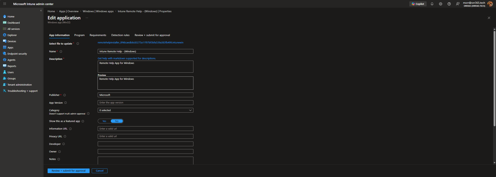
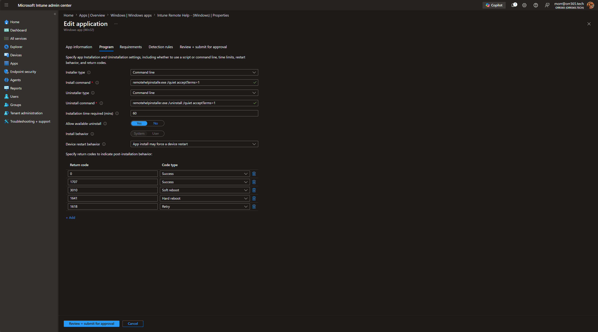
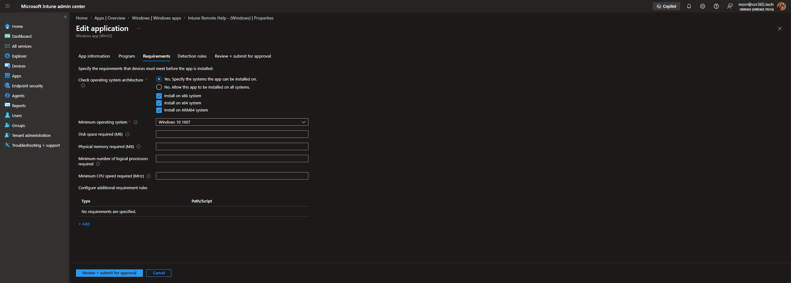
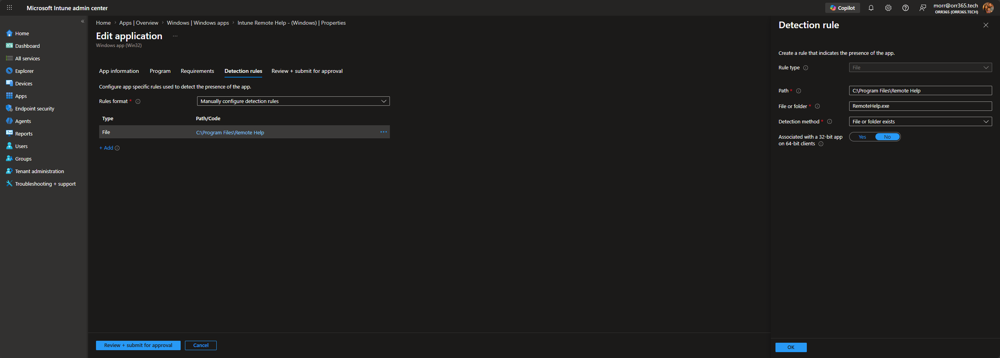
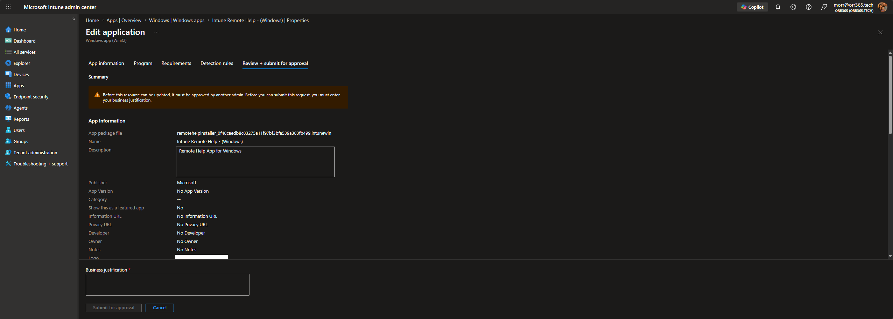

# Intune Remote Help

Deployment-ready **Microsoft Remote Help** installer, provided as both the standalone `.exe` and a prepackaged `.intunewin` file for uploading as a **Win32 app** in Microsoft Intune.

## Repository structure

```
.
├── exe/
│   └── remotehelpinstaller.exe                                                 # raw installer
├── intunewin/
│   └── remotehelpinstaller.intunewin                                           # Win32 app package (upload this)
└── Images/                                                                     # step-by-step screenshots
```

Upload the file in **`intunewin/`** — it is the `.exe` already wrapped with the Microsoft Win32 Content Prep Tool.

---

## Deploy to Intune

In the [Microsoft Intune admin center](https://intune.microsoft.com): **Apps → Windows → Add**, and choose app type **Windows app (Win32)**. Select the `.intunewin` file from the `intunewin/` folder, then work through the tabs below.

### 1. App information



| Field | Value |
|-------|-------|
| Name | `Intune Remote Help - (Windows)` |
| Description | `Remote Help App for Windows` |
| Publisher | `Microsoft` |
| Show this as a featured app | No |

### 2. Program



| Field | Value |
|-------|-------|
| Install command | `remotehelpinstaller.exe /quiet acceptTerms=1` |
| Uninstall command | `remotehelpinstaller.exe /uninstall /quiet acceptTerms=1` |
| Install behavior | System |
| Device restart behavior | App install may force a device restart |

**Return codes**

| Code | Type |
|------|------|
| 0 | Success |
| 1707 | Success |
| 3010 | Soft reboot |
| 1641 | Hard reboot |
| 1618 | Retry |

### 3. Requirements



| Field | Value |
|-------|-------|
| Operating system architecture | x86, x64, ARM64 |
| Minimum operating system | Windows 10 1607 |

### 4. Detection rules



Rules format: **Manually configure detection rules** → add a **File** rule:

| Field | Value |
|-------|-------|
| Rule type | File |
| Path | `C:\Program Files\Remote Help` |
| File or folder | `RemoteHelp.exe` |
| Detection method | File or folder exists |
| Associated with a 32-bit app on 64-bit clients | No |

### 5. Assignments

Assign the app to your target user or device groups as **Required** (or **Available** for self-service from the Company Portal).

### 6. Review + create



Review the summary and select **Create** to upload and publish the app. Intune will begin delivering it to assigned devices at the next check-in.

> **Note:** In the screenshots above the app already existed, so the final tab reads **Review + submit for approval** (this tenant uses multi-admin approval). On a first-time upload this tab is **Review + create**.

---

## Verifying installation

After the app installs, confirm success on a target device:

- **Detection:** `C:\Program Files\Remote Help\RemoteHelp.exe` exists
- **Client logs:** `C:\ProgramData\Microsoft\IntuneManagementExtension\Logs\AppWorkload.log`
- **Portal:** Apps → *Intune Remote Help - (Windows)* → **Device install status**

## Uninstall

Available-assigned installs can be removed from the Company Portal. For required deployments, change the assignment to **Uninstall** for the target group, or run:

```
remotehelpinstaller.exe /uninstall /quiet acceptTerms=1
```
